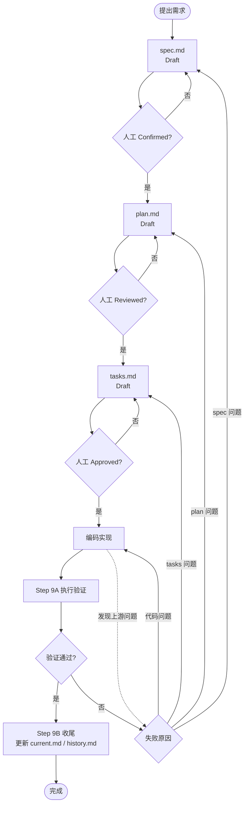

# SDD Workflow

本文档是当前项目的 SDD 日常开发流程说明，面向开发者和 AI 协作者。

`AGENTS.md` 是 AI 入口，`docs/sdd/commands/*` 是工具无关的 SDD 命令说明，`.codex/skills/sdd-*` 是 Codex 适配入口。本文档说明团队如何实际使用这套流程。

不同 Agent 工具都应读取 `AGENTS.md`、本文档和 `docs/sdd/commands/*`。不要把 `.codex/skills` 当成唯一规则源；它只是 Codex 的快捷触发层。

推荐先用 `sdd-use` 选择或创建当前 feature。用户只需要输入短命令，例如 `sdd-use user-export`，AI 会自动创建或覆盖 `.sdd/current-feature`，不需要人工创建或维护这个文件。选择后，后续同一项目的新会话也可以直接使用 `sdd-spec`、`sdd-plan`、`sdd-tasks`、`sdd-apply`、`sdd-validate`、`sdd-archive`，不需要每次重复输入 feature 号。

短命令和完整自然语言都支持。推荐日常使用短命令，完整自然语言作为补充说明。

## 0. 流程总览



### 阶段说明

| 阶段 | 产物 | AI 可以做什么 | 人必须做什么 | 下一阶段门禁 |
| --- | --- | --- | --- | --- |
| 创建需求规格 | `spec.md` | 起草 Draft spec | review 需求、验收、影响范围 | `Status: Confirmed` |
| 方案设计 | `plan.md` | 基于 Confirmed spec 起草方案 | review 技术方案、风险、验证策略 | `Status: Reviewed` |
| 任务拆解 | `tasks.md`，条件性交付物：`api-change.md`、`db-change.md`、`config-change.md` | 基于 Reviewed plan 拆任务，并按影响范围生成接口、数据库、配置变更说明 | review 任务粒度、范围和交付物 | `Status: Approved` |
| 编码实现 | 代码变更；必要时更新项目级事实源 | 按 Approved tasks 实现 | 确认是否需要回退 | tasks 仍为 Approved |
| 执行验证 | `validate.md` | 按 SDD 执行验证并记录证据，核对项目级事实源一致性 | 判断失败是否可接受 | 无阻塞性 `FAIL` |
| 验证后收尾 | `current.md`、`history.md` | 更新模块事实和历史 | review 文档是否准确 | 可提交 PR / 合并 |

### 状态说明

| 文件 | 草稿状态 | 人工通过状态 | 回退规则 |
| --- | --- | --- | --- |
| `spec.md` | `Draft` | `Confirmed` | 需求、验收或业务规则变化时，`Confirmed -> Draft`，同时 `plan/tasks` 回退 |
| `plan.md` | `Draft` | `Reviewed` | 方案、影响范围或验证策略变化时，`Reviewed -> Draft`，同时 `tasks` 回退 |
| `tasks.md` | `Draft` | `Approved` | 任务拆解、测试任务、文档任务或 tasks 阶段交付物变化时，`Approved -> Draft` |
| `validate.md` | 记录中 | 通过 / 不通过结论 | 验证失败不得收尾，必须修代码或回退到对应阶段 |

### 逆向流程

| 触发点 | 处理方式 |
| --- | --- |
| 编码时发现任务漏项 | 停止编码，回退 `tasks.md`，重新人工 Approved |
| 编码时发现方案不可行 | 停止编码，回退 `plan.md`，同步回退 `tasks.md` |
| 编码或验证时发现需求/验收错误 | 停止编码，回退 `spec.md`，同步回退 `plan.md` 和 `tasks.md` |
| 验证失败但 SDD 文件正确 | 修复代码，重新执行 Step 9A |
| 验证失败且 SDD 文件不正确 | 按失败原因回退 `tasks/plan/spec` |

## 1. 核心原则

- 没有 Confirmed `spec.md`，不得生成正式 `plan.md`。
- 没有 Reviewed `plan.md`，不得生成正式 `tasks.md`。
- 没有 Approved `tasks.md`，不得让 AI 执行实现。
- 实现完成后，必须先执行验证并填写 `validate.md`；只有验证通过后，才能更新相关模块 `current.md` 和 `history.md`。
- AI 可以起草和更新 SDD 文档，但业务确认、方案 review 和最终责任在人。

## 2. 新需求流程

### Step 1: 选择或创建当前 Feature

适用场景：

- 开始一个全新 feature。
- 继续开发已有 feature。
- 换了一个 Codex 会话。
- 当前项目下有多个 feature，需要明确本次推进哪一个。
- 从别人的 feature 接手继续开发。

Skill 使用示例：

```text
sdd-use {feature-name}
```

AI 行为：

- 解析用户输入的 feature 名、feature 目录名或 feature 路径。
- 如果用户只输入 feature 名，自动使用当天日期生成 feature 目录名。
- 如果 feature 目录不存在，创建 feature 目录。
- 如果 feature 目录已存在，选择该目录。
- 如果用户未输入 feature，且当前项目只有一个候选 feature，则自动选择。
- 自动创建或覆盖 `.sdd/current-feature`。
- 输出当前阶段状态和下一步建议。

用户不需要手工创建 `.sdd/current-feature`。

### Step 2: 创建 Draft Spec

Skill 使用示例：

```text
sdd-spec
{需求描述}
```

AI 行为：

- 读取 `.sdd/current-feature`
- 在当前 feature 目录下生成 `spec.md`
- 只生成 `spec.md`
- `spec.md` 状态保持 `Draft`
- 不生成 `plan.md`、`tasks.md`、`validate.md`
- 不修改业务代码

### Step 3: 人工确认 Spec

人工 review `spec.md`：

- 背景和问题是否准确。
- Goals / Non-Goals 是否完整。
- Success Metrics 是否可衡量。
- Acceptance Criteria 是否可验证。
- 影响模块是否遗漏。
- 权限、安全、数据兼容是否明确。
- 是否明确最小影响范围，避免把未确认需求带入本 feature。
- 是否识别性能、容量、可扩展性、异常边界、健壮性和可维护性要求；不涉及时是否说明原因。
- Open Questions 是否全部关闭。

关闭 Open Questions 的方式：

```md
- [x] Q: {待确认问题}
  A: {确认后的答案或决策}
```

只有所有 Open Questions 都为 `[x]`，且答案足以支撑实现和验证时，才能继续确认 `spec.md`。

确认后人工修改：

```md
## 0. Confirmation

- Status: Confirmed
- Confirmed By: {name}
- Confirmed At: {yyyy-mm-dd}
```

### Step 4: 生成 Plan

Skill 使用示例：

```text
sdd-plan
```

AI 行为：

- 读取 `spec.md`
- 检查 `Status: Confirmed`
- 检查 `Confirmed By` 非空
- 检查 `Confirmed At` 非空
- 检查 `Open Questions` 已全部关闭：所有问题为 `[x]`，并包含 `A`
- 通过后生成 `plan.md`
- `plan.md` 状态保持 `Draft`

### Step 5: 人工 Review Plan

人工 review `plan.md`：

- 是否符合 `spec.md`。
- 是否尊重现有架构边界。
- 是否说明影响范围。
- 是否说明事务、权限、兼容性、数据迁移和验证方式。
- 是否说明最小影响实现策略，哪些现有行为、接口、数据、配置和模块明确不改。
- 是否说明可扩展性取舍：复用现有边界还是新增抽象 / 配置 / 依赖，以及必要性。
- 是否说明异常边界和健壮性：空值、非法输入、外部依赖失败、并发、重试、部分成功、资源释放。
- 是否说明性能与容量风险：批量、分页、循环、远程调用、文件解析、ES / Redis / MQ / 数据库访问。
- 是否说明关键代码可读性要求：关键业务规则和非显然逻辑是否需要中文注释。
- 是否明确哪些验收条件需要自动化测试，哪些不能自动化以及原因。
- 是否存在过度设计或不必要依赖。

确认后人工修改：

```md
## 0. Review Status

- Status: Reviewed
- Reviewed By: {name}
- Reviewed At: {yyyy-mm-dd}
```

### Step 6: 生成 Tasks

Skill 使用示例：

```text
sdd-tasks
```

AI 行为：

- 读取 `plan.md`
- 检查 `Status: Reviewed`
- 检查 `Reviewed By` 非空
- 检查 `Reviewed At` 非空
- 通过后生成 `tasks.md`
- 如果涉及接口变更，同步生成或更新 `api-change.md`
- 如果涉及表结构、索引、初始化数据、修复脚本或回滚 SQL，同步生成或更新 `db-change.md`
- 如果涉及 Nacos、Redis、RocketMQ、RabbitMQ、ES mapping / 索引模板 / alias、环境变量、JVM 参数或其他配置，同步生成或更新 `config-change.md`
- 判断是否涉及项目级事实源：`architecture.md`、`domain-map.md`、`glossary.md`、`constitution.md`
- 项目级事实源在 tasks 阶段只声明影响和拆任务，不直接修改文件
- 在 `tasks.md` 中说明上述交付物是否适用；不适用时必须写明原因
- `tasks.md` 状态保持 `Draft`

### Step 7: 人工确认 Tasks

人工 review `tasks.md`：

- 任务是否覆盖 `plan.md` 的实现范围。
- 每个任务是否足够小，可以独立执行和验证。
- 是否包含验证任务。
- 是否包含必要的自动化测试代码编写任务。
- 是否包含最小影响检查、异常边界测试、关键代码中文注释检查、性能 / 容量验证或未执行原因。
- 是否包含更新 feature `validate.md`、模块 `current.md`、模块 `history.md` 的任务。
- 涉及接口变更时，`api-change.md` 是否记录接口路径、方法、鉴权、请求、响应、错误码、兼容性和验证方式。
- 涉及数据库变更时，`db-change.md` 是否记录 DDL/DML、执行顺序、兼容策略、回滚 SQL 和验证方式。
- 涉及配置变更时，`config-change.md` 是否按 Nacos、Redis、RocketMQ、RabbitMQ、ES mapping / 索引模板 / alias、环境变量、JVM 参数或其他配置分类记录。
- 项目级事实源影响判断是否准确：`architecture.md`、`domain-map.md`、`glossary.md`、`constitution.md` 是否适用及原因是否明确。
- 如果项目级事实源适用，是否已拆出对应的 `sdd-apply` 更新任务和 `sdd-validate` 一致性验证任务。
- 是否存在超出 `spec.md` 和 `plan.md` 的实现内容。

确认后人工修改：

```md
## 0. Execution Status

- Status: Approved
- Approved By: {name}
- Approved At: {yyyy-mm-dd}
```

### Step 8: 实现

Skill 使用示例：

```text
sdd-apply
```

AI 或开发者行为：

- 读取 `tasks.md`。
- 如果存在 `api-change.md`、`db-change.md`、`config-change.md`，同步读取并按其中的接口、数据库、配置要求实现。
- 检查 `Status: Approved`。
- 检查 `Approved By` 非空。
- 检查 `Approved At` 非空。
- 按 `tasks.md` 修改代码。
- 按 `tasks.md` 的 Project Docs Impact 更新适用的项目级事实源：`architecture.md`、`domain-map.md`、`glossary.md`、`constitution.md`。
- 如果 `tasks.md` 包含自动化测试任务，在编码阶段同时编写或更新测试代码。
- 不做 `tasks.md` 之外的扩展需求。
- 代码实现必须遵守最小影响原则：不改未列入任务的接口、字段、状态、配置、数据结构和公共行为。
- 关键业务规则、状态流转、异常边界、排序/解析/加密/并发等非显然逻辑必须补充简洁中文注释。
- 实现必须覆盖已识别的异常边界；发现新的异常边界、性能风险或扩展性问题超出当前 `tasks.md` 时，必须停止并进入回退流程。
- 如果实现中发现 `spec.md`、`plan.md`、`tasks.md` 或 tasks 阶段交付物需要修改，必须进入回退流程，停止编码，重新通过人工门禁。
- 如果实现中发现 Project Docs Impact 与真实变化不一致，必须进入回退流程，停止编码，重新通过人工门禁。

### Step 9A: 执行验证

触发时机：

- 代码实现完成后。
- 准备提交 PR、合并或上线前。
- 尚未更新模块 `current.md` 和 `history.md` 前。

Skill 使用示例：

```text
sdd-validate
```

AI 行为：

- 读取 `spec.md` 的 Acceptance Criteria 和 Success Metrics。
- 读取 `plan.md` 的 Validation Plan。
- 读取 `tasks.md` 的 Validation Tasks。
- 读取 `api-change.md`、`db-change.md`、`config-change.md` 中适用的接口、数据库、配置验证要求。
- 读取相关模块 `validate.md`。
- 核对 `tasks.md` 中 Project Docs Impact：适用的项目级事实源是否已更新且与代码、feature 文档和模块文档一致；不适用项是否有明确原因。
- 执行编码阶段已补充的自动化测试。
- 无法自动化验证时，记录接口验证、手工验证或未执行原因。
- 验证最小影响原则：确认未改动范围未被破坏，接口、字段、配置、数据结构和模块边界保持预期。
- 验证异常边界、性能 / 容量风险、关键代码中文注释和可读性要求；不涉及或未执行时必须说明原因。
- 创建或更新 feature `validate.md`。
- 按相关模块 `validate.md` 执行验证。
- 将验证结果、证据、失败原因和未执行原因写入 feature `validate.md`。

验证失败时：

- 必须停止流程。
- 不得更新模块 `current.md`。
- 不得更新模块 `history.md`。
- 不得进入收尾。
- 必须说明失败原因和建议处理方式。

失败原因判断：

| 失败原因 | 处理方式 |
| --- | --- |
| 代码实现错误，但 `spec.md`、`plan.md`、`tasks.md` 都仍然正确 | 修复代码后重新执行 Step 9A |
| `tasks.md` 遗漏任务或验证项 | 回退 `tasks.md` |
| `plan.md` 方案错误或验证方案错误 | 回退 `plan.md` |
| `spec.md` 需求、验收条件或数据口径错误 | 回退 `spec.md` |

### Step 9B: 验证通过后收尾

触发条件：

- feature `validate.md` 中无阻塞性 `FAIL`。
- 必须执行的验证均为 `PASS`。
- `NOT RUN` 项均有明确且可接受的原因。
- 不存在需要回退 `spec.md`、`plan.md` 或 `tasks.md` 的问题。

Skill 使用示例：

```text
sdd-archive
```

AI 行为：

- 读取 feature `validate.md`。
- 确认不存在阻塞性 `FAIL`。
- 确认 `NOT RUN` 项均有原因。
- 更新相关模块 `current.md`。
- 更新相关模块 `history.md`。
- 不在归档阶段临时新增或修改项目级事实源；如果发现 `architecture.md`、`domain-map.md`、`glossary.md`、`constitution.md` 未按 Project Docs Impact 同步，停止收尾并回退到对应阶段处理。
- 最终回复说明验证结果、收尾文件和剩余风险。

## 3. 回退流程

SDD 允许回退，但回退必须显式记录，不能在已确认文件上静默修改。

回退时必须遵守：

- 先停止编码或验证。
- 再回退状态。
- 再修改对应 SDD 文件。
- 再重新通过人工门禁。
- 最后才能继续下一阶段。

### 3.1 判断应该回退到哪一层

| 发现的问题 | 回退到 |
| --- | --- |
| 任务拆解不完整、任务顺序不合理、缺少测试任务、缺少文档更新任务、缺少 `api-change.md` / `db-change.md` / `config-change.md` 交付物 | `tasks.md` |
| 实现方案不可行、事务边界不对、权限策略不对、兼容性方案不对、验证方案不对 | `plan.md` |
| 需求范围变化、验收条件变化、业务规则变化、权限规则变化、数据口径变化 | `spec.md` |

项目级事实源回退判断：

| 发现的问题 | 回退到 |
| --- | --- |
| 只是漏判或误判 Project Docs Impact，或缺少 `architecture.md` / `domain-map.md` / `glossary.md` / `constitution.md` 更新任务 | `tasks.md` |
| 技术方案、架构边界、模块职责或验证策略变化导致项目级文档内容需要调整 | `plan.md` |
| 业务概念、术语口径、状态含义、权限规则或数据口径变化 | `spec.md` |

如果不确定回退到哪一层，按更上游处理：

```text
不确定 tasks 还是 plan -> 回退 plan
不确定 plan 还是 spec -> 回退 spec
```

### 3.2 回退 tasks.md

适用场景：

- 编码时发现任务拆解不完整。
- 任务粒度过大或顺序不合理。
- 需要补充验证任务或文档更新任务。
- 需要新增或修改 `api-change.md`、`db-change.md`、`config-change.md`。
- 需要新增、删除或修改 Project Docs Impact，或补充项目级事实源更新任务。

Skill 使用示例：

```text
sdd-tasks rollback
{说明为什么 tasks.md 需要修改}
```

AI 行为：

1. 停止编码。
2. 读取 `tasks.md`。
3. 将 `tasks.md` 状态改回 `Draft`。
4. 清空 `Approved By` 和 `Approved At`。
5. 在 `tasks.md` 的 Reopen History 追加记录。
6. 根据回退原因修改 `tasks.md`。
7. 如果回退前已经修改了项目级事实源，不静默撤销；保留现有改动，待 `tasks.md` 重新 Approved 后按最新任务修正。
8. 最终回复提醒用户重新 review tasks。

人工确认后修改：

```md
## 0. Execution Status

- Status: Approved
- Approved By: {name}
- Approved At: {yyyy-mm-dd}
```

继续使用示例：

```text
sdd-apply
```

AI 必须重新检查 `tasks.md` 已 Approved 后，才能继续编码。

### 3.3 回退 plan.md

适用场景：

- 实现方案不可行。
- 影响范围、事务边界、权限策略、兼容性策略需要调整。
- 发现原方案存在较大技术风险。

Skill 使用示例：

```text
sdd-plan rollback
{说明为什么 plan.md 需要修改}
```

AI 行为：

1. 停止编码。
2. 读取 `plan.md` 和 `tasks.md`。
3. 将 `plan.md` 状态改回 `Draft`。
4. 清空 `Reviewed By` 和 `Reviewed At`。
5. 在 `plan.md` 的 Reopen History 追加记录。
6. 将 `tasks.md` 状态改回 `Draft`。
7. 清空 `tasks.md` 的 `Approved By` 和 `Approved At`。
8. 在 `tasks.md` 的 Reopen History 追加记录，原因写明 `Plan reopened`。
9. 根据回退原因修改 `plan.md`。
10. 最终回复提醒用户重新 review plan。

人工确认 plan 后修改：

```md
## 0. Review Status

- Status: Reviewed
- Reviewed By: {name}
- Reviewed At: {yyyy-mm-dd}
```

继续使用示例：

```text
sdd-tasks
```

AI 行为：

1. 重新检查 `plan.md` 已 Reviewed。
2. 重新生成或更新 `tasks.md`。
3. 保持 `tasks.md` 为 `Draft`。
4. 提醒用户重新 approve tasks。

人工重新 approve `tasks.md` 后，才能继续编码。

### 3.4 回退 spec.md

适用场景：

- 需求范围变化。
- 验收条件变化。
- 业务规则、权限规则、数据口径或兼容性要求变化。

Skill 使用示例：

```text
sdd-spec rollback
{说明为什么 spec.md 需要修改}
```

AI 行为：

1. 停止编码。
2. 读取 `spec.md`、`plan.md`、`tasks.md`。
3. 将 `spec.md` 状态改回 `Draft`。
4. 清空 `Confirmed By` 和 `Confirmed At`。
5. 在 `spec.md` 的 Reopen History 追加记录。
6. 将 `plan.md` 状态改回 `Draft`。
7. 清空 `plan.md` 的 `Reviewed By` 和 `Reviewed At`。
8. 在 `plan.md` 的 Reopen History 追加记录，原因写明 `Spec reopened`。
9. 将 `tasks.md` 状态改回 `Draft`。
10. 清空 `tasks.md` 的 `Approved By` 和 `Approved At`。
11. 在 `tasks.md` 的 Reopen History 追加记录，原因写明 `Spec reopened`。
12. 根据回退原因修改 `spec.md`。
13. 最终回复提醒用户重新确认 spec。

人工确认 spec 后修改：

```md
## 0. Confirmation

- Status: Confirmed
- Confirmed By: {name}
- Confirmed At: {yyyy-mm-dd}
```

继续使用示例：

```text
sdd-plan
```

AI 行为：

1. 重新检查 `spec.md` 已 Confirmed。
2. 重新生成或更新 `plan.md`。
3. 保持 `plan.md` 为 `Draft`。
4. 提醒用户重新 review plan。

后续必须重新完成：

```text
plan Reviewed -> tasks Draft -> tasks Approved -> code
```

### 3.5 回退期间禁止事项

- 禁止在 SDD 文件回退后继续编码。
- 禁止 AI 自行把 `spec.md` 改为 `Confirmed`。
- 禁止 AI 自行把 `plan.md` 改为 `Reviewed`。
- 禁止 AI 自行把 `tasks.md` 改为 `Approved`。
- 禁止只改下游文件而不回退上游状态。

### 3.6 回退后已有代码的处理

如果回退发生时工作区里已经有部分代码修改，必须按以下规则处理：

1. 先停止继续编码，不要基于旧设计继续补写代码。
2. 保留已存在的代码改动，不要在没有确认的情况下随意丢弃或重置。
3. 等上游 `spec.md` / `plan.md` / `tasks.md` 重新通过人工门禁后，再重新执行 `sdd-apply`。
4. 重新进入 `sdd-apply` 时，AI 必须按当前最新的 `spec.md`、`plan.md`、`tasks.md`、`api-change.md`、`db-change.md`、`config-change.md` 重新理解实现目标。
5. 如果回退前已经修改了项目级事实源，保留现有改动，不静默撤销；重新进入 `sdd-apply` 后按最新 Project Docs Impact 修正。
6. 如果旧代码或旧项目级文档修改与新设计冲突，必须按新设计修正；如果冲突点无法直接判断，先报告冲突，再由人工决定保留、修改或回退。
7. 不得把“回退前遗留的旧代码或旧文档修改”当作已确认实现继续沿用。

## 4. 项目级事实源维护责任

项目级事实源用于稳定描述项目整体约束，不记录普通 feature 流水账。

| 文件 | 触发更新的典型场景 | 更新时间点 |
| --- | --- | --- |
| `architecture.md` | 架构边界、分层、关键链路、外部依赖、认证 / 权限 / SQL 执行 / 文件处理等关键机制变化 | `sdd-apply`，前提是 `tasks.md` 的 Project Docs Impact 已标记适用 |
| `domain-map.md` | 新增、拆分、合并模块，调整模块职责、业务域、代码入口或数据对象映射 | `sdd-apply`，前提是 `tasks.md` 的 Project Docs Impact 已标记适用 |
| `glossary.md` | 新增或调整业务术语、状态、缩写、关键字段口径，或术语需跨模块统一 | `sdd-apply`，前提是 `tasks.md` 的 Project Docs Impact 已标记适用 |
| `constitution.md` | 工程红线、协作规则、安全规则或技术原则变化 | `sdd-apply`，普通业务需求通常不适用 |

规则：

- `sdd-plan` 负责在 Impact Analysis 中提示是否可能影响项目级事实源。
- `sdd-tasks` 负责在 Project Docs Impact 中做适用性判断并拆任务，不直接修改项目级事实源。
- `sdd-apply` 负责按 Approved tasks 修改适用的项目级事实源。
- `sdd-validate` 负责核对项目级事实源与代码、feature 文档和模块文档一致。
- `sdd-archive` 只更新模块级 `current.md` / `history.md`；如果项目级事实源未同步或未验证，必须停止收尾。

## 5. 模块文档维护责任

模块文档不是只能人工填写，也不能完全交给 AI 自动决定。

推荐责任划分：

| 文件 | AI 可以做什么 | 人必须做什么 |
| --- | --- | --- |
| `current.md` | 根据代码和 feature 结果起草或覆盖更新 | review 是否真实反映线上行为 |
| `validate.md` | 根据模块风险补充验证清单 | 确认验证要求是否足够覆盖风险 |
| `history.md` | 根据 feature 信息追加记录 | 确认 feature、branch、commit、状态准确 |

规则：

- `current.md` 是模块当前真实行为，必须覆盖更新，不写流水账。
- 如果模块 `current.md` 与代码实现不一致，先以代码实现为准理解当前行为，再补充修正文档。
- `validate.md` 是模块级验证要求，不记录某次 feature 的执行结果。
- `history.md` 是模块 feature 时间线，只追加记录。
- AI 更新这些文件后，人工必须 review。

## 6. 新人加入流程

新人接需求前先阅读：

1. `AGENTS.md`
2. `docs/sdd/constitution.md`
3. `docs/sdd/architecture.md`
4. `docs/sdd/domain-map.md`
5. `docs/sdd/glossary.md`
6. 相关模块 `current.md`
7. 相关模块 `validate.md`
8. 相关模块 `history.md`

新人第一周建议只做：

- 阅读一个模块的 `current.md`。
- 跟着一个低风险 feature 跑完整 SDD 流程。
- 在 PR 中完整填写 SDD Checklist。

## 7. 常用提示

查看 SDD 流程和命令帮助：

```text
sdd-help
```

查看某个命令的作用和示例：

```text
sdd-help sdd-plan
```

选择或创建当前 feature：

```text
sdd-use {feature-name}
```

`{feature-name}` 可以是简短 feature 名、带日期的目录名或完整路径；`.sdd/current-feature` 由 AI 自动写入。完整自然语言也支持，例如 `使用 sdd-use 设置当前 feature：user-export`。

查看当前状态：

```text
sdd-status
```

生成 spec：

```text
sdd-spec
{需求描述}
```

生成方案：

```text
sdd-plan
```

生成任务：

```text
sdd-tasks
```

执行实现：

```text
sdd-apply
```

执行验证：

```text
sdd-validate
```

验证通过后收尾：

```text
sdd-archive
```

回退：

```text
sdd-tasks rollback
{原因}
```

```text
sdd-plan rollback
{原因}
```

```text
sdd-spec rollback
{原因}
```
